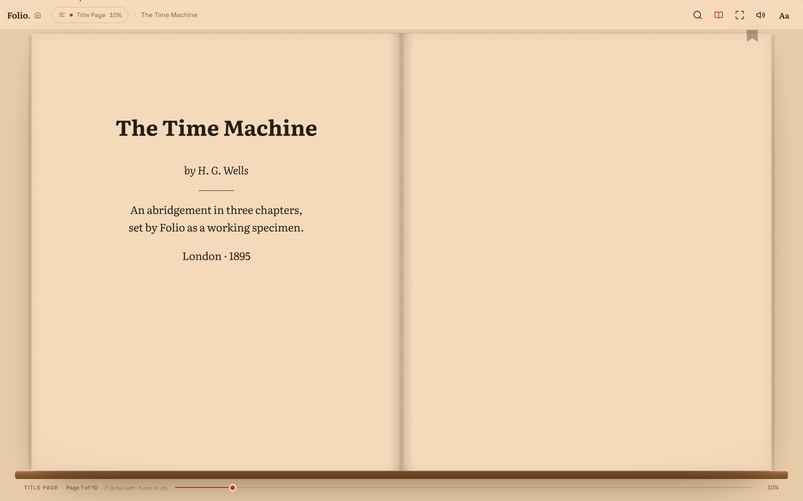
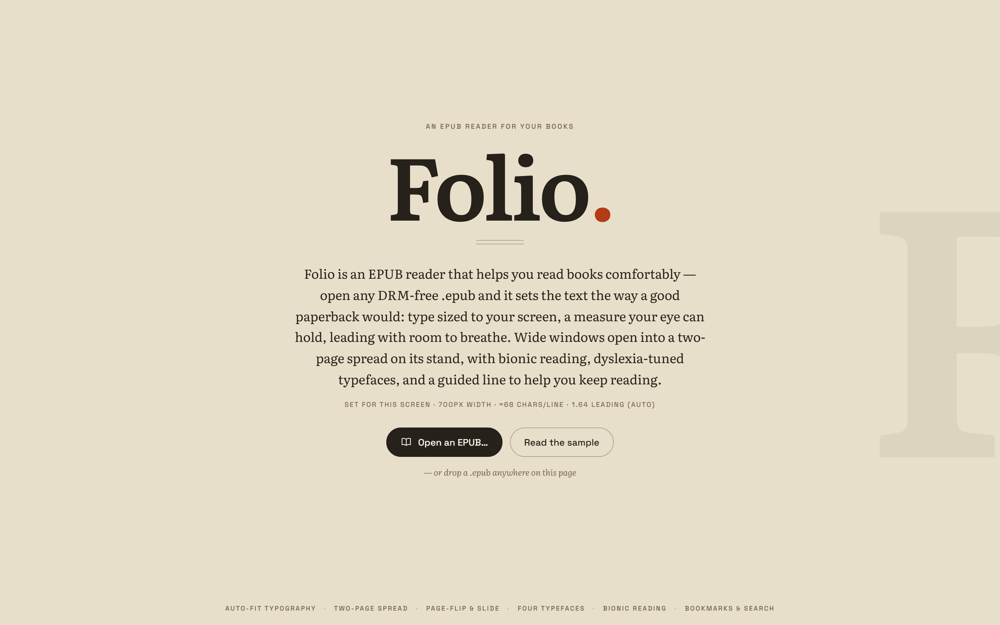
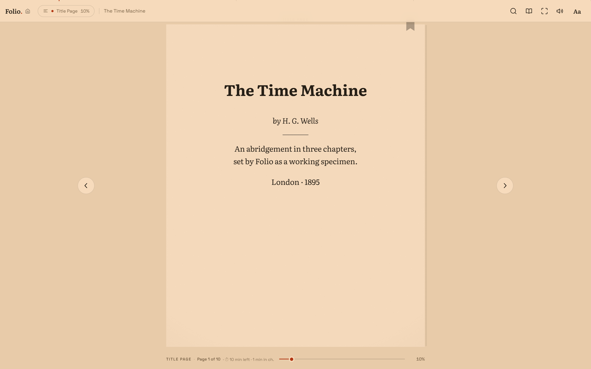
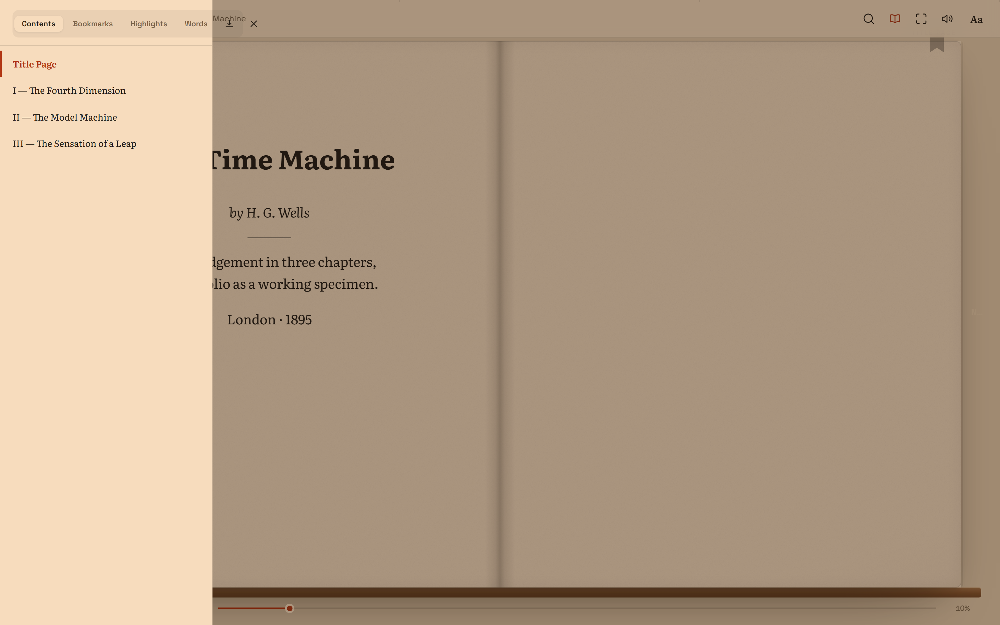
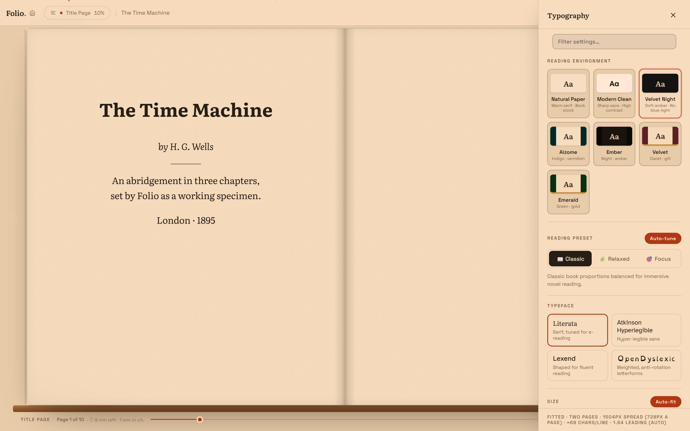
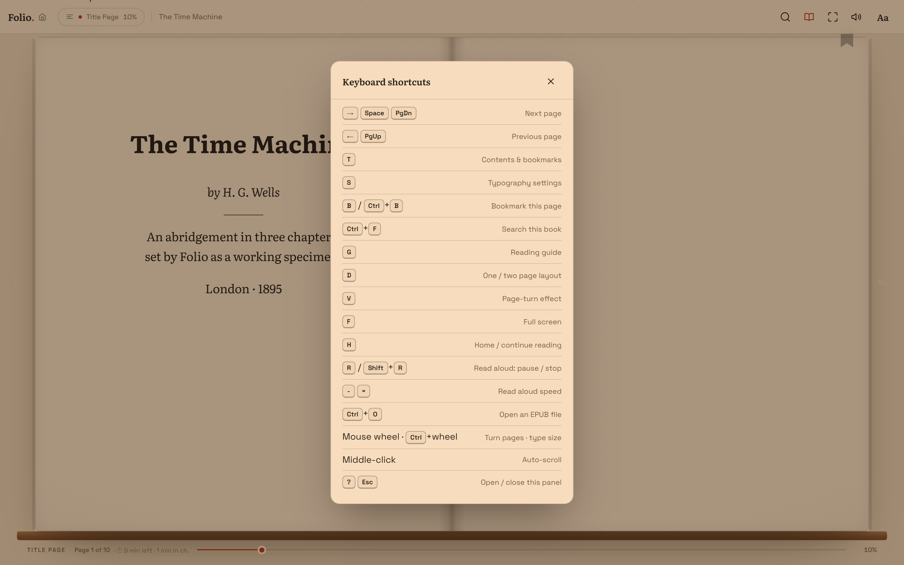
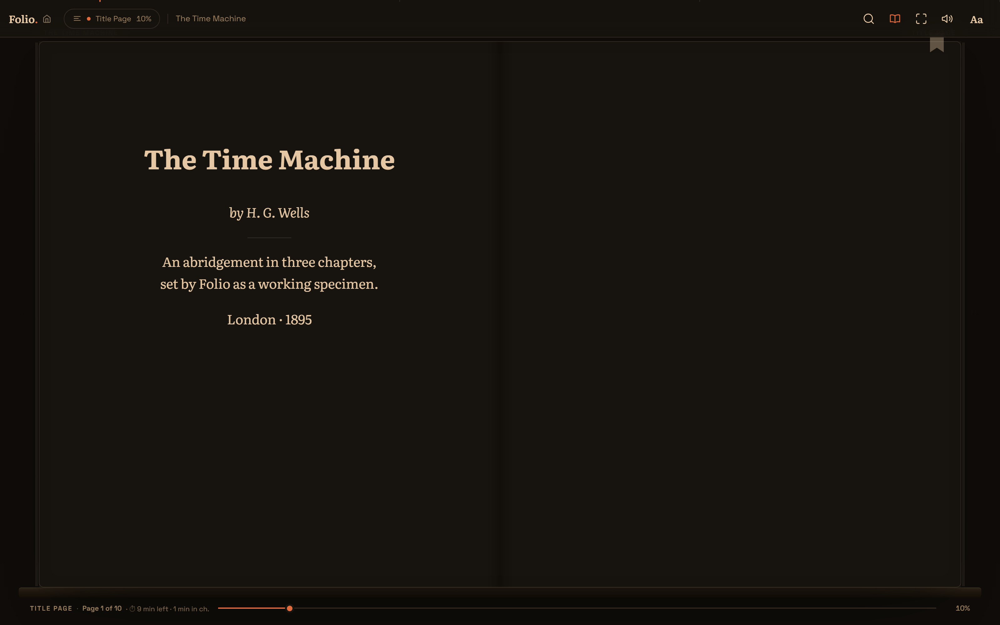

# Folio — a paper-grade EPUB reader for Windows

Folio is a lightweight desktop EPUB reader built with **Tauri 2.0** and the native Edge WebView2 — no bundled browser, ~9 MB standalone executable, fully offline. It opens any DRM-free `.epub` and sets the text the way a good paperback would: type sized to your screen, a measure your eye can hold, leading with room to breathe. Wide windows open into a two-page spread on its stand.



## Screenshots

| Landing | Single page |
|---|---|
|  |  |

| Contents drawer | Typography & settings |
|---|---|
|  |  |

| Keyboard shortcuts | Velvet Night theme |
|---|---|
|  |  |

## Features

### Getting books in
- **Open any DRM-free EPUB 2/3** (reflowable) — native file picker (`Ctrl+O`), drag & drop onto the window, double-click via Windows `.epub` file association, or CLI argument. A second launch forwards its file to the running window instead of spawning a duplicate.
- **Built-in sample book** — an embedded abridgement of *The Time Machine* for an instant first-run experience.
- **Recent shelf with cover thumbnails** and a "Continue reading" resume button (restores your exact position via CFI).
- **Fast re-opens** — books are decompressed once into a zip-slip-safe Rust-side disk cache served over a custom `folio-cache://` protocol (600 MB / 30-book LRU eviction), with raw binary IPC for first loads. Fully offline: epub.js, JSZip, and all fonts are bundled locally.

### Reading experience
- **Auto-fit typography** — page width (460–2000 px) and font size (15–28 px, 0.1 steps) with auto-fit; a typographic harmony engine tunes line height, letter/word spacing, and margins to hold ~68 characters per line.
- **Four bundled typefaces** — Literata, Lexend, Atkinson Hyperlegible, and OpenDyslexic (local WOFF2), plus justified text, drop caps, and bionic reading (bold word prefixes).
- **Curated reading environments** — Natural Paper, Modern Clean, Velvet Night, Aizome, Ember, and Emerald; manual theme pick or auto day/night following the OS, plus a warmth (blue-light) slider.
- **Per-book typography memory** — each book remembers its own settings.
- **Paper-grade page turns** — a GPU-composited fold-sheet flip (paper texture, warm fold light, crease sheen, damped-spring physics, drag-to-turn with fling) plus slide and instant FX modes, and a toggleable page-turn sound. Render path animates `transform`/opacity only, with GPU rasterization forced in WebView2.
- **Reading ruler** — a guide line that follows the pointer for focus reading.

### Layout
- **Single page / two-page spread** (`D`) — auto (width-based), forced on, or off, with independent width memory per mode.
- **Running header** with chapter / book title above the page.

### Navigation & progress
- **Table of contents** (`T`) with windowed rendering for huge TOCs and current-chapter marking.
- **Progress everywhere** — draggable progress rail with page-granularity scrubbing and a non-destructive preview (chapter, page, excerpt) plus a "Return to Page X" safety anchor; a hairline chapter ribbon across the top with click-to-jump segments; book-wide "page N of M" from persisted CFI locations; per-chapter page badge; time-left-in-chapter estimate.
- **Chapter ribbons** on both screen edges for previous/next chapter (`[` / `]`).
- **Bookmarks** (`B`) per book with badge count, plus middle-click auto-scroll and mouse-wheel page turning (`Ctrl+Wheel` = type size, `Alt+Wheel` = page width).

### Highlights, notes & lookup
- **Highlights in four colors** and **click-to-annotate notes**, persisted per book and managed from the drawer; export notes as Markdown.
- **Full-book search** (`Ctrl+F`) with excerpt highlighting and jump-to-match; the index builds across idle time and persists progress. "Find in book" from the selection toolbar.
- **Word definitions** on selection (online API with an offline cache of previously fetched words), plus copy and speak selection actions.

### Read aloud & stats
- **Text-to-speech** — play/pause (`R`), stop (`Shift+R`), speed (`-` / `=`), sentence highlighting, and auto page advance.
- **Reading stats** — session/day minutes, pages turned, and day streak, shown on the landing page.

### Chrome & polish
- **Auto-hiding chrome** (3.4 s) and fullscreen (`F`); footnote popups, image lightbox/zoom, and a keyboard-shortcuts overlay (`?`).

## Keyboard shortcuts

| Keys | Action |
|---|---|
| `→` / `Space` / `PgDn` · `←` / `PgUp` | Next / previous page |
| `T` · `S` | Contents · Typography settings |
| `B` / `Ctrl+B` | Bookmark this page |
| `Ctrl+F` | Search this book |
| `G` · `D` · `V` | Reading guide · one/two-page layout · page-turn effect |
| `F` · `H` | Full screen · Home / continue reading |
| `R` / `Shift+R` · `-` / `=` | Read aloud pause/stop · speed |
| `Ctrl+O` | Open an EPUB file |
| Mouse wheel · `Ctrl+Wheel` · `Alt+Wheel` | Turn pages · type size · page width |
| Middle-click | Auto-scroll |
| `[` / `]` | Previous / next chapter |
| `?` / `Esc` | Show / hide this panel |

## Building & running

Requires Node and the Rust toolchain (Windows: WebView2 ships with the OS).

```powershell
cd tauri_epub_reader

npm run dev          # development mode
npm run build        # optimized release build
```

Build artifacts:

- Standalone executable: `tauri_epub_reader/src-tauri/target/release/app.exe`
- Installers: `src-tauri/target/release/bundle/nsis/Folio Reader_1.0.0_x64-setup.exe` and `bundle/msi/Folio Reader_1.0.0_x64_en-US.msi`

### Tests

```powershell
npm test             # Rust unit tests + Playwright e2e suite
npm run test:e2e     # browser suite only (serves src/ on :8124)
npm run test:rust    # Rust unit tests only
```

The e2e suite is demo-book driven and covers book open, pagination/turns, persisted locations, rail seeking, TTS lifecycle, highlights, themes, per-book typography, footnotes, lightbox, dictionary cache, drawer chrome, and more.

### Screenshots

The screenshots above are captured from the real frontend with Playwright:

```powershell
node tests/manual/capture_readme_shots.mjs   # from tauri_epub_reader/
```

It serves `src/` locally, opens the embedded demo book, walks through the main views (landing, single page, spread, contents, settings, shortcuts, night theme), and writes PNGs to `docs/screenshots/`.

## Project structure

```
├── docs/
│   └── screenshots/               # README screenshots (auto-generated)
└── tauri_epub_reader/
    ├── README.md                  # app-level development notes
    ├── docs/
    │   ├── DESIGN_AND_LLD.md      # design document & low-level design
    │   ├── FEATURES.md            # capability tracking & roadmap
    │   ├── DESIGN-IMPROVEMENTS.md # performance & UI design batches
    │   └── UX_V2_LLD_PLAN.md      # UX batch plan
    ├── src/                       # desktop frontend (single-file app + vendored epub.js/JSZip/fonts)
    ├── src-tauri/                 # Rust backend (file IPC, disk cache, folio-cache:// protocol)
    └── tests/                     # Playwright e2e specs + manual harnesses
```

Note: `frontendDist` points at `src/`, so **everything** in `src/` ships inside the executable — keep design sources and scratch files out of it (large `.eps` live in `design-sources/`).
