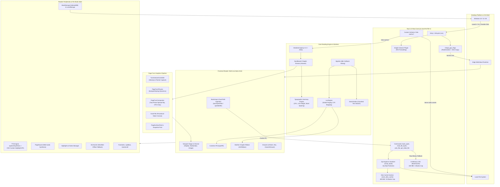
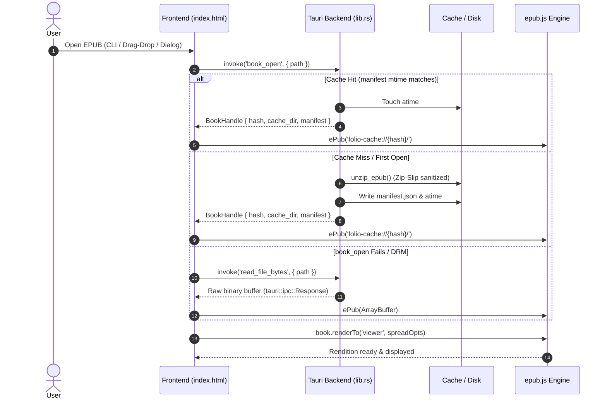
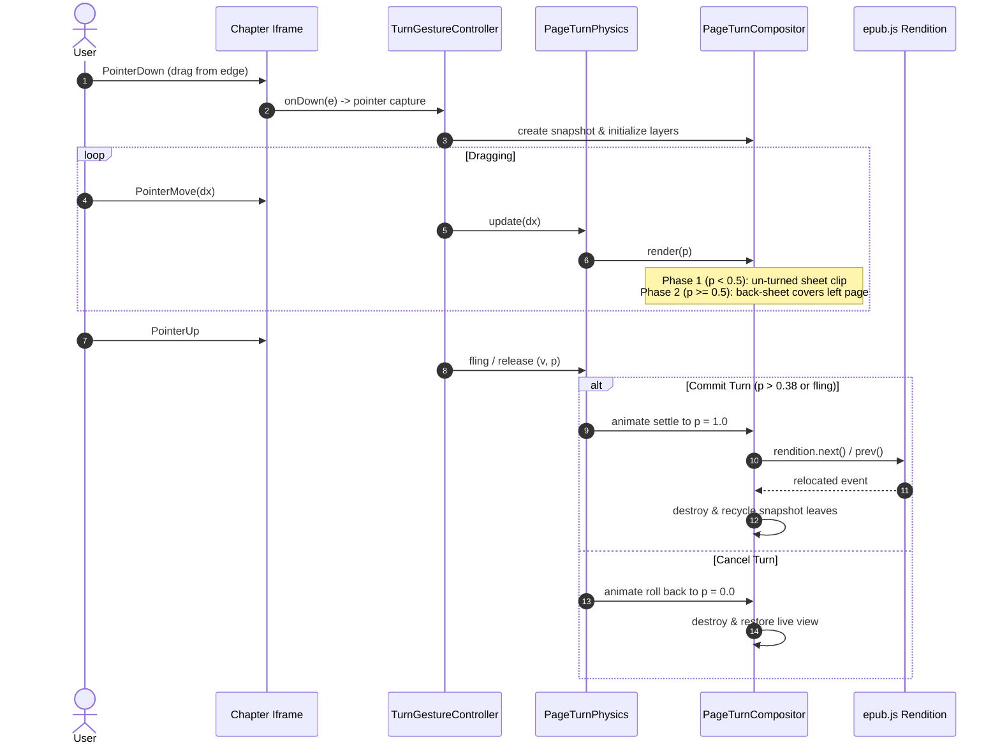
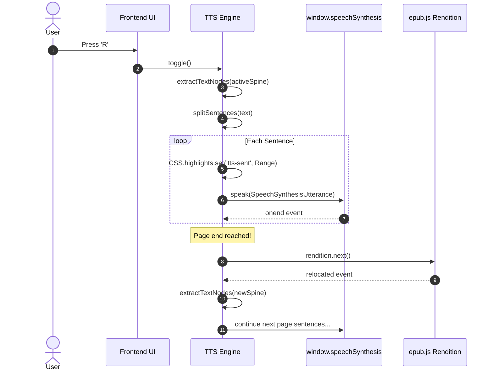

# Folio Reader — Comprehensive Design Document & Low-Level Design (LLD)

> **Audience:** Core developers, new contributors, and maintainers.  
> **Scope:** Architecture, subsystem low-level design, feature-to-code mapping, data schemas, sequence flows, and testing suite.  
> **Repository:** `ebook_reader_glm53flash` / `tauri_epub_reader`  
> **Last Updated:** 2026-09-25

---

## 1. Executive Summary & System Architecture

Folio Reader is an ultralight (~9 MB standalone executable), privacy-first, offline-native EPUB reader for Windows. It couples a native **Tauri 2.0 (Rust)** backend with **native Windows Edge WebView2**, completely eliminating the overhead of bundled Chromium browsers while delivering a 60 FPS, GPU-accelerated paper reading experience.

### 1.1 High-Level Architecture



### 1.2 Architectural Invariants & Non-Negotiables

1. **Zero-Copy / Binary IPC Discipline:** EPUB files are never serialized across the JSON bridge as numeric arrays. Unzipped books are served through the native `folio-cache://` protocol scheme directly from disk; fallback opens use `tauri::ipc::Response` raw byte vectors.
2. **GPU-Composited Animation Guarantee:** The 3D paper fold and slide page turns write exclusively to `transform` (`translateX`, `rotateY`, `translateZ`), `opacity`, and `clip-path` CSS properties. Live text inside iframes is never subjected to matrix rotation during reading; pre-rasterized snapshot leaves are used instead.
3. **Never-Freeze Main Thread:** Heavy background jobs (CFI location generation and full-text search indexing) run in cooperative idle slices (`requestIdleCallback`, 2–6 spines/tick, paused when `document.hidden`).
4. **Complete Offline Autonomy:** Zero remote CDN dependencies. All reader scripts (`epub.min.js`, `jszip.min.js`), local fonts (Literata, Lexend, Atkinson Hyperlegible, OpenDyslexic), and styling are bundled locally.

---

## 2. Repository & File Manifest

### 2.1 File Map

| File Path | Type | Size / Lines | Primary Responsibilities |
|---|---|---|---|
| [`tauri_epub_reader/src-tauri/src/main.rs`](file:///f:/Siva_f/ebook_reader_glm53flash/tauri_epub_reader/src-tauri/src/main.rs) | Rust | 7 lines | Windows release subsystem declaration (`windows_subsystem = "windows"`), delegates to `app_lib::run()`. |
| [`tauri_epub_reader/src-tauri/src/lib.rs`](file:///f:/Siva_f/ebook_reader_glm53flash/tauri_epub_reader/src-tauri/src/lib.rs) | Rust | 671 lines | Tauri commands, custom URI protocol `folio-cache://`, unzipper, zip-slip validator, LRU disk & memory caches, GPU flags, single-instance listener, and Rust unit tests (U1–U5). |
| [`tauri_epub_reader/src-tauri/Cargo.toml`](file:///f:/Siva_f/ebook_reader_glm53flash/tauri_epub_reader/src-tauri/Cargo.toml) | TOML | 30 lines | Rust crate dependencies: `tauri 2.11`, `tauri-plugin-single-instance`, `rfd 0.17`, `zip 2`, `sha2 0.10`, `serde`, `serde_json`. |
| [`tauri_epub_reader/src-tauri/tauri.conf.json`](file:///f:/Siva_f/ebook_reader_glm53flash/tauri_epub_reader/src-tauri/tauri.conf.json) | JSON | 47 lines | Window configurations (1280x820, min 800x600), security CSP, app bundle icons, and `.epub` Windows file associations. |
| [`tauri_epub_reader/src-tauri/capabilities/default.json`](file:///f:/Siva_f/ebook_reader_glm53flash/tauri_epub_reader/src-tauri/capabilities/default.json) | JSON | 12 lines | Tauri 2 security capability ACL manifest assigning `core:default` permissions to the `main` window. |
| [`tauri_epub_reader/src-tauri/build.rs`](file:///f:/Siva_f/ebook_reader_glm53flash/tauri_epub_reader/src-tauri/build.rs) | Rust | 3 lines | Tauri build script invoking `tauri_build::build()`. |
| [`tauri_epub_reader/src/index.html`](file:///f:/Siva_f/ebook_reader_glm53flash/tauri_epub_reader/src/index.html) | HTML/CSS/JS | 5,776 lines (262 KB) | Complete frontend presentation, layout CSS, reading engine, 3D paper turn compositor, progress rail, ribbon, pill, TTS, search, annotations, and UI drawers. |
| [`tauri_epub_reader/src/vendor/jszip.min.js`](file:///f:/Siva_f/ebook_reader_glm53flash/tauri_epub_reader/src/vendor/jszip.min.js) | JS | 98 KB | Bundled local JSZip library for browser-mode unzipping and EPUB parsing. |
| [`tauri_epub_reader/src/vendor/epub.min.js`](file:///f:/Siva_f/ebook_reader_glm53flash/tauri_epub_reader/src/vendor/epub.min.js) | JS | 224 KB | Vendored epub.js 0.3 library providing EPUB spine navigation, Rendition, and CFI locations. |
| [`tauri_epub_reader/src/vendor/fonts/`](file:///f:/Siva_f/ebook_reader_glm53flash/tauri_epub_reader/src/vendor/fonts/) | WOFF2 | 11 font files | Offline font assets: Literata, Lexend, Atkinson Hyperlegible, OpenDyslexic (400, 600, 700 weights). |
| [`tauri_epub_reader/package.json`](file:///f:/Siva_f/ebook_reader_glm53flash/tauri_epub_reader/package.json) | JSON | 23 lines | Project scripts (`dev`, `build`, `test`, `test:e2e`, `test:rust`), devDependencies for Playwright and HTTP server. |
| [`tauri_epub_reader/playwright.config.mjs`](file:///f:/Siva_f/ebook_reader_glm53flash/tauri_epub_reader/playwright.config.mjs) | JS | 32 lines | Playwright E2E configuration serving `src/` on port 8124, 1 worker, single-test isolation. |
| [`tauri_epub_reader/tests/e2e/helpers.mjs`](file:///f:/Siva_f/ebook_reader_glm53flash/tauri_epub_reader/tests/e2e/helpers.mjs) | JS | 325 lines | Test utilities: `fresh()`, `openDemoReady()`, `viewerFrame()`, `SPEECH_MOCK`, in-memory synthetic EPUB builders (`buildTestEpub`, `generateStressBuffer`), pointer drag helpers (`slowDrag`, `fastFling`). |
| [`tauri_epub_reader/tests/e2e/shipped.spec.mjs`](file:///f:/Siva_f/ebook_reader_glm53flash/tauri_epub_reader/tests/e2e/shipped.spec.mjs) | JS | 312 lines | Regression specs R1–R16 verifying core reader features, wheel turning, rail scrub, TTS lifecycle, annotations, warmth, and drawers. |
| [`tauri_epub_reader/tests/e2e/design.spec.mjs`](file:///f:/Siva_f/ebook_reader_glm53flash/tauri_epub_reader/tests/e2e/design.spec.mjs) | JS | 571 lines | Design specs D1–D12 verifying contents pill, chapter ribbon, paper texture benchmark, full-spread two-phase fold, background slicing, index resume, and disk cache fallbacks. |
| [`tauri_epub_reader/docs/FEATURES.md`](file:///f:/Siva_f/ebook_reader_glm53flash/tauri_epub_reader/docs/FEATURES.md) | Markdown | 177 lines | High-level capabilities tracking, roadmap, and GPU budget summary. |
| [`tauri_epub_reader/docs/DESIGN-IMPROVEMENTS.md`](file:///f:/Siva_f/ebook_reader_glm53flash/tauri_epub_reader/docs/DESIGN-IMPROVEMENTS.md) | Markdown | 477 lines | Architectural specifications for disk cache (P-A), idle work slicing (P-B), contents pill (A-A), chapter ribbon (A-B), paper flip (A-C), and full-spread flip (A-S). |

---

## 3. Subsystem Low-Level Design (LLD) & Feature-to-Code Mapping

---

### Subsystem 1: Desktop Shell & Rust Backend

#### 1.1 Command-Line Arguments & File Association Launch
* **Functionality:** Double-clicking an `.epub` file in Windows Explorer launches the app and immediately displays the book. Passing a file path via the CLI opens it directly.
* **Code Location:**
  * Rust: [`tauri_epub_reader/src-tauri/src/lib.rs`](file:///f:/Siva_f/ebook_reader_glm53flash/tauri_epub_reader/src-tauri/src/lib.rs#L10-L24) — `get_initial_file()`, `first_epub_arg()`.
  * Config: [`tauri_epub_reader/src-tauri/tauri.conf.json`](file:///f:/Siva_f/ebook_reader_glm53flash/tauri_epub_reader/src-tauri/tauri.conf.json#L37-L44) — `bundle.fileAssociations` maps extension `epub`.
  * Frontend: [`tauri_epub_reader/src/index.html`](file:///f:/Siva_f/ebook_reader_glm53flash/tauri_epub_reader/src/index.html#L5768-L5773) — Startup hook calls `invoke('get_initial_file')` and triggers `tauriOpenPath(p)`.
* **Execution Flow:**
  ```
  Explorer -> app.exe "C:\Books\Dune.epub" -> first_epub_arg(std::env::args())
  Frontend mounted -> invoke('get_initial_file') -> tauriOpenPath(path)
  ```

#### 1.2 Single Instance & Cross-Process Forwarding
* **Functionality:** If the app is already open and a user double-clicks another `.epub`, a second instance does not spawn. Instead, the running window is unminimized, brought to focus, and instructed to open the newly requested book.
* **Code Location:**
  * Rust: [`tauri_epub_reader/src-tauri/src/lib.rs`](file:///f:/Siva_f/ebook_reader_glm53flash/tauri_epub_reader/src-tauri/src/lib.rs#L506-L517).
  * Frontend: [`tauri_epub_reader/src/index.html`](file:///f:/Siva_f/ebook_reader_glm53flash/tauri_epub_reader/src/index.html#L5768) — `window.__folioOpenPath = tauriOpenPath;`.
* **Details:** The `tauri-plugin-single-instance` catches the second process invocation, extracts the `.epub` argument via `first_epub_arg(args)`, focuses `win.set_focus()`, and evals `window.__folioOpenPath(<path>)`.

#### 1.3 Native File Dialog
* **Functionality:** Users can press `Ctrl + O` or click "Open book" to open a native Windows File Explorer dialog filtered to `*.epub`.
* **Code Location:**
  * Rust: [`tauri_epub_reader/src-tauri/src/lib.rs`](file:///f:/Siva_f/ebook_reader_glm53flash/tauri_epub_reader/src-tauri/src/lib.rs#L114-L120) — `pick_file()` via `rfd::FileDialog`.
  * Frontend: [`tauri_epub_reader/src/index.html`](file:///f:/Siva_f/ebook_reader_glm53flash/tauri_epub_reader/src/index.html#L5744-L5766).

#### 1.4 Unzipped Disk Cache (`book_open`) & Custom Protocol (`folio-cache://`)
* **Functionality:** Bypasses JSZip heap inflation on repeated opens. Books are decompressed once into `{app_cache_dir}/folio-unzip/{hash}/`. Subsequent opens serve files directly to `epub.js` via the `folio-cache://` protocol with accurate MIME types.
* **Code Location:**
  * Rust: [`tauri_epub_reader/src-tauri/src/lib.rs`](file:///f:/Siva_f/ebook_reader_glm53flash/tauri_epub_reader/src-tauri/src/lib.rs#L122-L359, #L435-L501).
    * `compute_book_key()`: Key derived from `sha256(path) + file_length + mtime_ms`.
    * `sanitize_entry()`: Path traversal / Zip-Slip protection.
    * `unzip_epub()`: Extracts archive using `zip` crate; writes `manifest.json` and `atime`.
    * `evict_disk_cache()`: Background thread evicts least recently opened directories exceeding 600 MB or 30 books.
    * Protocol handler: `register_uri_scheme_protocol("folio-cache", ...)`.
  * Frontend: [`tauri_epub_reader/src/index.html`](file:///f:/Siva_f/ebook_reader_glm53flash/tauri_epub_reader/src/index.html#L5681-L5708) — `openEpubPath()`, `tauriOpenPath()`.

#### 1.5 In-Memory LRU Cache & Raw Binary IPC
* **Functionality:** When disk unzipping is bypassed or fails, `read_file_bytes()` returns raw bytes using `tauri::ipc::Response`, backed by a 4-book / 160 MB in-memory LRU (`BookCache`).
* **Code Location:**
  * Rust: [`tauri_epub_reader/src-tauri/src/lib.rs`](file:///f:/Siva_f/ebook_reader_glm53flash/tauri_epub_reader/src-tauri/src/lib.rs#L30-L112).

#### 1.6 GPU Rasterization Flag Injection
* **Functionality:** Forces Edge WebView2 to hardware-rasterize 2D graphics and keep textures zero-copy on the GPU.
* **Code Location:**
  * Rust: [`tauri_epub_reader/src-tauri/src/lib.rs`](file:///f:/Siva_f/ebook_reader_glm53flash/tauri_epub_reader/src-tauri/src/lib.rs#L407-L433) — `merge_gpu_flags()`.
  * Environment variable: `WEBVIEW2_ADDITIONAL_BROWSER_ARGUMENTS = "--enable-gpu-rasterization --enable-zero-copy --ignore-gpu-blocklist"`.

---

### Subsystem 2: Book Ingestion & State Initialization



* **Code Location:**
  * `ensureEpubUrlPatched()`: [`tauri_epub_reader/src/index.html`](file:///f:/Siva_f/ebook_reader_glm53flash/tauri_epub_reader/src/index.html#L1650-L1688).
  * `openBuffer()`: [`tauri_epub_reader/src/index.html`](file:///f:/Siva_f/ebook_reader_glm53flash/tauri_epub_reader/src/index.html#L1690-L1795).
  * `createRendition()`: [`tauri_epub_reader/src/index.html`](file:///f:/Siva_f/ebook_reader_glm53flash/tauri_epub_reader/src/index.html#L1621-L1648).
  * `BookStorage`: [`tauri_epub_reader/src/index.html`](file:///f:/Siva_f/ebook_reader_glm53flash/tauri_epub_reader/src/index.html#L1281-L1465) (IndexedDB storage for browser-only fallbacks).

---

### Subsystem 3: Reading Engine & Typographic Harmony

#### 3.1 Typographic Harmony Engine
* **Functionality:** Dynamically computes optimal reading ergonomics based on Characters Per Line (CPL). Calculates line-height, letter-spacing, and word-spacing continuously as the user resizes the window or adjusts font size.
* **Code Location:** [`tauri_epub_reader/src/index.html`](file:///f:/Siva_f/ebook_reader_glm53flash/tauri_epub_reader/src/index.html#L1000-L1070)
  * `calcCPL()`: Computes average line length in characters (`effectiveWidth / (fontSize * fontAvgCharWidth)`).
  * `calcTypographicHarmony()`: Applies Bringhurst typographic rules to adjust line height (1.35–1.75), letter spacing (-0.02em to +0.03em), and word spacing.
  * Presets: `PRESETS.classic`, `PRESETS.relaxed`, `PRESETS.focus`, `PRESETS.auto` ([`index.html:973`](file:///f:/Siva_f/ebook_reader_glm53flash/tauri_epub_reader/src/index.html#L973)).

#### 3.2 Dynamic Layout, Spread & Auto-Fit
* **Functionality:** Seamlessly alternates between single-page view and two-page spread. In `auto` mode, automatically converts to dual-spread when viewport width exceeds 960 px.
* **Code Location:** [`tauri_epub_reader/src/index.html`](file:///f:/Siva_f/ebook_reader_glm53flash/tauri_epub_reader/src/index.html#L1072-L1120, #L1614-L1620)
  * `effectiveSpread()`: Evaluates `settings.spread` (`auto`, `spread`, `single`).
  * `applyFit()`: Calculates CSS column widths and writes inline styles to `#viewer`.

#### 3.3 Typography Memory & Bionic Reading
* **Functionality:**
  * **Per-Book Typography:** Persists custom font family, size, line-height, and margins keyed by book title (`folio-typo:<title>`).
  * **Bionic Reading:** Automatically parses chapter DOM text nodes and wraps the first 40–50% of each word in `<b>` tags to guide rapid eye fixation.
* **Code Location:**
  * Typography Memory: [`tauri_epub_reader/src/index.html`](file:///f:/Siva_f/ebook_reader_glm53flash/tauri_epub_reader/src/index.html#L903-L912) — `loadPerBookType()`.
  * Bionic Engine: [`tauri_epub_reader/src/index.html`](file:///f:/Siva_f/ebook_reader_glm53flash/tauri_epub_reader/src/index.html#L1958-L2015) — `bionifyDoc()`, `debionify()`, `setBionic()`.

---

### Subsystem 4: Page-Turn Graphics Pipeline & 3D Physics

```mermaid
flowchart LR
    subgraph Input_Stage["Input Stage"]
        PDown["PointerDown / Wheel / Key"]
        Gesture["TurnGestureController\n120ms velocity tracker"]
    end

    subgraph Simulation_Stage["Simulation Stage"]
        Physics["PageTurnPhysics\nDamped Spring (omega=24, zeta=0.88)"]
        Fling["Velocity Fling Commit\nThreshold: v > 0.45 or p > 0.38"]
    end

    subgraph Compositing_Stage["Compositing Stage (PageTurnCompositor)"]
        Phase1["Phase 1 (p < 0.5)\nFront Sheet: un-turned remainder [foldX, W]\nUnderneath: incoming page"]
        Phase2["Phase 2 (p >= 0.5)\npt-back-sheet covers opposite page [foldX, spineX]\nSpine valley dims out"]
        Shaders["GPU Layers (transform / opacity)\nShared GrainTile (256x256 multiply)\nSpecular crease sheen & fold shadow"]
    end

    subgraph Rendition_Stage["Rendition Settle"]
        Next["state.rendition.next() / prev()"]
        Cleanup["Blank & recycle snapshot surfaces"]
    end

    PDown --> Gesture
    Gesture --> Physics
    Physics --> Fling
    Fling --> Phase1
    Phase1 --> Phase2
    Phase2 --> Shaders
    Shaders --> Next
    Next --> Cleanup
```



#### 4.1 PageTurnCompositor & Full-Spread Two-Phase Fold
* **Functionality:** Generates realistic paper fold effects. In dual-page spread mode, the fold sweeps **across the entire spread**:
  * **Phase 1 ($p < 0.5$):** Turning leaf lifts from the outer margin; remaining un-turned page is clipped via `clip-path: inset(0 R 0 0)`.
  * **Phase 2 ($p \ge 0.5$):** The back of the turning page (`.pt-back-sheet`) travels across the spine, physically overlapping and dimming the opposite page.
  * **GPU Invariant:** Live text is never rotated in 3D. Transformations are applied to pre-rasterized snapshot nodes using hardware-accelerated CSS properties only.
* **Code Location:** [`tauri_epub_reader/src/index.html`](file:///f:/Siva_f/ebook_reader_glm53flash/tauri_epub_reader/src/index.html#L3682-L4085)
  * `init()`: Constructs compositor DOM hierarchy (`.pt-sheet`, `.pt-back-sheet`, `.pt-fold-shadow`, `.pt-curl-highlight`, `.pt-spine-valley`).
  * `render(p)`: Evaluates phase geometry, updates `clip-path`, scales fold shadows, and adjusts spine valley opacity (`index.html:3810-3940`).

#### 4.2 Paper-Grade Aesthetics: Grain Tile & Settle Audio
* **Functionality:**
  * **GrainTile:** Generates a 256×256 procedural noise texture canvas once at startup and applies it as a `multiply` blend layer without per-frame repaints.
  * **PageSound:** Synthesizes realistic paper friction audio using Web Audio API buffer nodes, including a secondary noise burst when passing the fold midpoint ($p = 0.5$).
* **Code Location:**
  * GrainTile: [`tauri_epub_reader/src/index.html`](file:///f:/Siva_f/ebook_reader_glm53flash/tauri_epub_reader/src/index.html#L4742-L4766).
  * PageSound: [`tauri_epub_reader/src/index.html`](file:///f:/Siva_f/ebook_reader_glm53flash/tauri_epub_reader/src/index.html#L4698-L4740).

#### 4.3 Damped-Spring Physics & Gesture Controller
* **Functionality:** Tracks touch and mouse drag gestures. Drops use a damped spring model ($\omega=24.0, \zeta=0.88$). Flings commit with low displacement if drag velocity exceeds threshold.
* **Code Location:**
  * Physics: [`tauri_epub_reader/src/index.html`](file:///f:/Siva_f/ebook_reader_glm53flash/tauri_epub_reader/src/index.html#L4087-L4124) — `PageTurnPhysics`.
  * Gesture Controller: [`tauri_epub_reader/src/index.html`](file:///f:/Siva_f/ebook_reader_glm53flash/tauri_epub_reader/src/index.html#L4125-L4374) — `TurnGestureController`.

---

### Subsystem 5: Navigation, Locations & Progress

#### 5.1 Global Book-Wide Paging Engine (`LocEngine`)
* **Functionality:** Computes true book-wide page counts ("Page 142 of 580") by dividing text into 1000-character CFI increments. Runs in cooperative idle slices and stores results per book in `localStorage['folio-locs:<title>']`.
* **Code Location:** [`tauri_epub_reader/src/index.html`](file:///f:/Siva_f/ebook_reader_glm53flash/tauri_epub_reader/src/index.html#L2090-L2210)
  * `ensure()`: Generates locations during idle windows (`BgJobs.run`).
  * `forCfi(cfi)`: Binary searches generated CFI array to find the exact global page index.
  * `refreshUI()`: Updates `#pageBadge` and informs the chapter ribbon.

#### 5.2 Hairline Chapter Progress Ribbon (`Ribbon`)
* **Functionality:** A 3 px top-edge structural map of the book. Each chapter is represented by a segment whose `flex-grow` is weighted by its CFI location count. An accent playhead tracks global reading progress. Clicking any segment jumps directly to that chapter. Dims to 45% when chrome auto-hides.
* **Code Location:** [`tauri_epub_reader/src/index.html`](file:///f:/Siva_f/ebook_reader_glm53flash/tauri_epub_reader/src/index.html#L2403-L2504)
  * `build()`: Creates segmented bar capped at 240 elements.
  * `rebuild()`: Re-proportions segments once `LocEngine` completes.
  * `move(frac)`: Smoothly transitions the playhead indicator.

#### 5.3 Top-Left Contents Pill (`#posPill`) & Closed-Drawer Isolation
* **Functionality:** Positioned in `#topbar`, displaying the truncated current chapter title and progress percent (e.g. "Chapter IV · 34%"). Clicking opens the Contents drawer.
* **Chrome Cleanliness Invariant:** Closed drawers (`#toc`, `#searchDrawer`, `#sheet`, `#helpOverlay`) enforce `visibility: hidden` in CSS, preventing transparent close buttons from capturing mouse hits at the top-left corner.
* **Code Location:**
  * Markup: [`tauri_epub_reader/src/index.html`](file:///f:/Siva_f/ebook_reader_glm53flash/tauri_epub_reader/src/index.html#L585-L589).
  * Logic: [`tauri_epub_reader/src/index.html`](file:///f:/Siva_f/ebook_reader_glm53flash/tauri_epub_reader/src/index.html#L2260-L2280) (updated inside `onRelocated()`).
  * Styles: [`tauri_epub_reader/src/index.html`](file:///f:/Siva_f/ebook_reader_glm53flash/tauri_epub_reader/src/index.html#L105-L135, #L320-L335).

#### 5.4 Progress Rail Scrubbing
* **Functionality:** Draggable scrub bar at the viewport bottom providing fine-grained page-by-page jumping via `LocEngine.cfiForFraction(f)`.
* **Code Location:** [`tauri_epub_reader/src/index.html`](file:///f:/Siva_f/ebook_reader_glm53flash/tauri_epub_reader/src/index.html#L5417-L5462) — `railSeek()`, `railFraction()`.

---

### Subsystem 6: Search & Lookup Engine

#### 6.1 Chunked Idle Search Indexer (`SearchIndex`)
* **Functionality:** Extracts and indexes chapter text in the background without causing frame drops.
  * **Slicing:** Processes 1–6 spines per tick depending on `deadline.timeRemaining()`.
  * **Persistence & Resume:** Saves progress in IndexedDB (`searchIndex` store). If interrupted or reloaded, resumes exactly where it left off.
  * **Visibility Pause:** Pauses indexing immediately when the app window is hidden or minimized (`document.hidden == true`).
* **Code Location:** [`tauri_epub_reader/src/index.html`](file:///f:/Siva_f/ebook_reader_glm53flash/tauri_epub_reader/src/index.html#L2980-L3180)
  * `_build()`: Main slice loop.
  * `prepare()`: Cache check and resume dispatcher.
  * `query(q)`: Regex match engine with context snippet generation.

#### 6.2 Offline Dictionary Cache (`DictCache`)
* **Functionality:** When a word is selected, "Define" looks up definitions from `api.dictionaryapi.dev` and caches results in `localStorage['folio-dict:<word>']` for offline reuse.
* **Code Location:** [`tauri_epub_reader/src/index.html`](file:///f:/Siva_f/ebook_reader_glm53flash/tauri_epub_reader/src/index.html#L4809-L4817).

---

### Subsystem 7: Annotations, Audio & Reading Polish

#### 7.1 Highlights & Note Editor (`Highlights`)
* **Functionality:** Select text to highlight in yellow, green, blue, or pink. Clicking an existing highlight opens an editor popup (`#hlPop`) to add notes, change colors, or delete the annotation. Highlights are listed in the TOC drawer's "Highlights" tab.
* **Code Location:** [`tauri_epub_reader/src/index.html`](file:///f:/Siva_f/ebook_reader_glm53flash/tauri_epub_reader/src/index.html#L2800-L2955)
  * `add()`, `update()`, `remove()`.
  * `openPop(id, pos)`: Floating popup positioning within viewport bounds.
  * `renderDrawer()`: Renders snippet list with click-to-jump.

#### 7.2 Read-Aloud TTS Engine (`TTS`)
* **Functionality:** Text-to-speech reading powered by `window.speechSynthesis`.
  * **Sentence Highlights:** Uses modern CSS Custom Highlight API (`::highlight(tts-sent)`) to highlight active sentences without altering DOM nodes.
  * **Auto-Advance:** When the final sentence on a page finishes reading, automatically triggers `rendition.next()` and continues playback seamlessly.
  * **Hotkeys:** `R` (play/pause), `Shift + R` (stop), `-` / `=` (decrease/increase rate).
* **Code Location:** [`tauri_epub_reader/src/index.html`](file:///f:/Siva_f/ebook_reader_glm53flash/tauri_epub_reader/src/index.html#L4490-L4696).

#### 7.3 Reading Polish Pack: Footnotes, Lightbox, AutoScroll & Warmth
* **Footnotes (`Footnotes`):** Catches clicks on EPUB `noteref` links and displays footnote text in an inline popup without losing reading place ([`index.html:4780-4808`](file:///f:/Siva_f/ebook_reader_glm53flash/tauri_epub_reader/src/index.html#L4780-L4808)).
* **Image Lightbox (`Lightbox`):** Clicking any image inside a chapter displays a full-viewport zoom overlay; dismissed with `Esc` ([`index.html:4768-4779`](file:///f:/Siva_f/ebook_reader_glm53flash/tauri_epub_reader/src/index.html#L4768-L4779)).
* **Auto-Scroll (`AutoScroll`):** Middle-click initiates autoscroll mode. Pointer distance from the center origin dynamically drives page advance speed ([`index.html:5501-5531`](file:///f:/Siva_f/ebook_reader_glm53flash/tauri_epub_reader/src/index.html#L5501-L5531)).
* **Warmth Filter:** Adjustable night-mode blue-light filter (`#warm` element with amber overlay) ([`index.html:913-927`](file:///f:/Siva_f/ebook_reader_glm53flash/tauri_epub_reader/src/index.html#L913-L927)).

---

### Subsystem 8: Chrome, Input & Accessibility

#### 8.1 Auto-Hiding Chrome
* **Functionality:** Top and bottom navigation bars slide out of view after 3.4 seconds of inactivity. Hovering near the top 64 px or bottom 76 px reveals the chrome instantly.
* **Code Location:** [`tauri_epub_reader/src/index.html`](file:///f:/Siva_f/ebook_reader_glm53flash/tauri_epub_reader/src/index.html#L4818-L4860).

#### 8.2 Keyboard & Mouse Shortcut Bindings

| Shortcut | Action | Handler Function / Code Location |
|---|---|---|
| `Left` / `Right` / `Space` | Turn previous / next page | `onKey()` ([`index.html:4950`](file:///f:/Siva_f/ebook_reader_glm53flash/tauri_epub_reader/src/index.html#L4950)) |
| `Ctrl + O` | Open native file picker | `onKey()` calls `openFileViaTauri()` |
| `D` | Toggle dual spread vs single page | `onKey()` toggles `settings.spread` |
| `T` | Toggle Table of Contents drawer | `toggleToc()` ([`index.html:4862`](file:///f:/Siva_f/ebook_reader_glm53flash/tauri_epub_reader/src/index.html#L4862)) |
| `A` | Toggle Appearance & Typography sheet | `toggleSheet()` ([`index.html:4861`](file:///f:/Siva_f/ebook_reader_glm53flash/tauri_epub_reader/src/index.html#L4861)) |
| `Ctrl + F` | Toggle Search drawer | `toggleSearch()` ([`index.html:2972`](file:///f:/Siva_f/ebook_reader_glm53flash/tauri_epub_reader/src/index.html#L2972)) |
| `B` | Toggle bookmark on current page | `onKey()` calls `toggleBookmark()` |
| `R` | Play / Pause TTS read-aloud | `TTS.toggle()` ([`index.html:4520`](file:///f:/Siva_f/ebook_reader_glm53flash/tauri_epub_reader/src/index.html#L4520)) |
| `Shift + R` | Stop TTS read-aloud | `TTS.stop()` ([`index.html:4550`](file:///f:/Siva_f/ebook_reader_glm53flash/tauri_epub_reader/src/index.html#L4550)) |
| `-` / `=` | Decrease / Increase TTS rate | `TTS.setRateDelta()` |
| `G` | Toggle reading guide line (ruler) | `setGuide()` ([`index.html:4476`](file:///f:/Siva_f/ebook_reader_glm53flash/tauri_epub_reader/src/index.html#L4476)) |
| `F` | Toggle fullscreen mode | `toggleFullscreen()` ([`index.html:4907`](file:///f:/Siva_f/ebook_reader_glm53flash/tauri_epub_reader/src/index.html#L4907)) |
| `?` | Toggle keyboard shortcuts modal | `toggleHelp()` ([`index.html:4873`](file:///f:/Siva_f/ebook_reader_glm53flash/tauri_epub_reader/src/index.html#L4873)) |
| `Esc` | Close all drawers, search, and dialogs | `closePanels()` ([`index.html:4863`](file:///f:/Siva_f/ebook_reader_glm53flash/tauri_epub_reader/src/index.html#L4863)) |
| `Wheel Up / Down` | Turn page backward / forward | `onWheel()` ([`index.html:5479`](file:///f:/Siva_f/ebook_reader_glm53flash/tauri_epub_reader/src/index.html#L5479)) |
| `Ctrl + Wheel` | Increase / Decrease font size | `onWheel()` calls `nudgeSize()` |
| `Alt + Wheel` | Increase / Decrease page width | `onWheel()` calls `nudgeWidth()` |
| `Middle Click` | Toggle autoscroll mode | `onDocPointerDown()` ([`index.html:5532`](file:///f:/Siva_f/ebook_reader_glm53flash/tauri_epub_reader/src/index.html#L5532)) |

---

## 4. Data Models, Schemas & Persistence

### 4.1 Rust Data Structures (`src-tauri/src/lib.rs`)

```rust
// Manifest of unzipped EPUB assets stored in manifest.json
#[derive(Serialize, Deserialize, Debug, Clone, PartialEq)]
pub struct ManifestFile {
    pub zip_path: String, // e.g. "OEBPS/ch1.xhtml"
    pub size: u64,
}

#[derive(Serialize, Deserialize, Debug, Clone, PartialEq)]
pub struct BookManifest {
    pub path: String,          // Original filesystem path
    pub len: u64,             // File length in bytes
    pub mtime_ms: u128,       // Last modified timestamp in ms
    pub files: Vec<ManifestFile>,
}

#[derive(Serialize, Deserialize, Debug, Clone)]
pub struct BookHandle {
    pub hash: String,          // Unique cache key (sha256 prefix + len + mtime)
    pub cache_dir: String,     // Absolute path on disk
    pub manifest: BookManifest,
}
```

### 4.2 LocalStorage Schema

| Key Pattern | Format | Description |
|---|---|---|
| `folio-settings` | JSON Object | Global user preferences: `{ font, size, theme, spread, turnFx, warmth, sound, grain, perBookType, ... }`. |
| `folio-locs:<Title>` | JSON Object | Persisted CFI location arrays from `LocEngine`: `{ title, total, locations: [cfi, ...] }`. |
| `folio-typo:<Title>` | JSON Object | Per-book typography settings overrides: `{ font, size, lineHeight, letter, word, margin, ... }`. |
| `folio-pos:<Title>` | String (CFI) | Last read position CFI for auto-resume. |
| `folio-highlights` | JSON Array | Array of highlights: `[{ id, cfi, color, note, text, time, bookTitle }]`. |
| `folio-bookmarks` | JSON Array | Array of bookmarks: `[{ id, cfi, title, label, time }]`. |
| `folio-recents` | JSON Array | Recent books list: `[{ title, author, pct, cfi, filePath, coverThumb }]`. |
| `folio-dict:<word>` | String | Cached definition text for offline dictionary lookups. |
| `folio-stats` | JSON Object | Reading activity: `{ minutesByDay: { [date]: mins }, pagesByDay: { [date]: count } }`. |

### 4.3 IndexedDB Schema (`folio-storage` Database)

* **Object Store: `books`**
  * Key: `title` (string).
  * Value: `{ title, author, buffer, filePath, cfi, date }` (used for browser fallback mode).
* **Object Store: `searchIndex`**
  * Key: `title` (string).
  * Value: `{ title, done, total, partial: boolean, chapters: [{ href, title, text }] }`.

---

## 5. End-to-End Sequence Workflows

### 5.1 Page Turn Workflow (Gesture -> Spring -> GPU Flip -> Relocation)



### 5.2 Text-to-Speech (TTS) Continuous Read-Aloud Workflow



---

## 6. Automated Test Suite & Verification Matrix

The project has comprehensive automated coverage across both backend and frontend, executable with a single command:
```powershell
npm test
```

### 6.1 Rust Unit Test Matrix (`cargo test` via `npm run test:rust`)

* **Source File:** [`tauri_epub_reader/src-tauri/src/lib.rs`](file:///f:/Siva_f/ebook_reader_glm53flash/tauri_epub_reader/src-tauri/src/lib.rs#L528-L670)

| Spec ID | Test Function | Target Feature | Validation Criteria |
|---|---|---|---|
| **U1** | `test_u1_book_cache_key` | In-memory cache key validity | Same length + mtime returns cache hit; file modification invalidates entry. |
| **U2** | `test_u2_book_cache_lru` | Memory LRU eviction | Exceeding 4 entries evicts the least recently accessed book. |
| **U3** | `test_u3_zip_slip` | Zip-Slip security validator | Rejects `../`, absolute paths (`/abs`), and Windows drive paths (`C:/`). Normal paths pass. |
| **U4** | `test_u4_manifest` | Manifest serialization | Manifest JSON roundtrips correctly; metadata changes trigger re-unzip. |
| **U5** | `test_u5_gpu_flags_merge` | GPU flag injection | Missing flags are appended; existing flags are preserved without duplication. |

### 6.2 Regression E2E Suite (`tests/e2e/shipped.spec.mjs`)

| Spec ID | Feature Under Test | Scenario & Assertions |
|---|---|---|
| **R1** | Global Paging | Book opens; `#pageBadge` displays "Page N of M"; `LocEngine.ready()` resolves true. |
| **R2** | Location Persistence | Re-opening the demo book loads locations from `localStorage` without calling `generate()`. |
| **R3** | Wheel & Key Turning | `ArrowRight` and mouse wheel (in shell and inside chapter iframe) advance pages. |
| **R4** | Progress Rail Scrub | Seeking with `railSeek(0.5)` changes page; seeking to 1 clamps to total without overflow. |
| **R5** | TTS Lifecycle | Starting TTS speaks sentence 1; toggle pauses; `TTS.stop()` clears Custom Highlight. |
| **R6** | TTS Auto-Advance | When sentences end on a page, triggers rendition advance; halts at book end. |
| **R7** | Highlights | Selecting text and picking a color dot creates an entry in `localStorage` and TOC drawer. |
| **R8** | Highlight Popups | Clicking highlight opens `#hlPop`; changing color updates fill; clicking delete removes it. |
| **R9** | Warmth Slider | Adjusting warmth slider changes `#warm` opacity; resets on "off"; persists across reload. |
| **R10** | Per-Book Typography | Adjusting font size with `perBookType` enabled preserves size per book independently. |
| **R11** | Footnote Popups | Clicking an EPUB `noteref` displays footnote text in `#fnPop.show`; outside click closes. |
| **R12** | Image Lightbox | Clicking an image opens full-viewport `#lightbox.show`; `Esc` closes. |
| **R13** | Dictionary Cache | Word lookup fulfills from API and saves to cache; second lookup resolves while offline. |
| **R14** | Drawer Chrome Isolation | Opening and closing drawers leaves no invisible hit-testable close icons at top-left. |
| **R15** | Boot-Open Integration | Faked Tauri backend cold-boots an EPUB into reading state directly. |
| **R16** | Autoscroll | Middle-click activates `AutoScroll.active`; moving pointer downward turns pages at rate. |

### 6.3 Design & Performance E2E Suite (`tests/e2e/design.spec.mjs`)

| Spec ID | Feature Under Test | Scenario & Assertions |
|---|---|---|
| **D1** | Contents Pill | `#posPill` tracks chapter and percent; truncates long titles; opens TOC on click. |
| **D2** | Top-Left ✕ Fix | Closed drawers never leak hit-testable SVG elements at coordinate (27, 38). |
| **D3** | Chapter Ribbon | Segment count matches chapters (capped at 240); playhead tracks %; click jumps; dims when hidden. |
| **D4** | Ribbon Re-weighting | When `LocEngine` completes, ribbon segments re-proportion based on location counts. |
| **D5** | Paper Texture Perf | Procedural grain tile adds zero per-turn overhead; single shared `toDataURL` invocation. |
| **D6** | Full-Spread Fold Phase 1 | At $p < 0.5$, right page clips un-turned remainder; opposite page remains untouched. |
| **D7** | Full-Spread Fold Phase 2 | At $p \ge 0.5$, `.pt-back-sheet` physically covers the left page; spine valley dims. |
| **D8** | Backward Mirror & Fling | Backward turns mirror geometry; high-velocity fling commits turn from low displacement. |
| **D9** | Fallback / Single Page | Single-page mode and `fullSpreadFold = false` bypass Phase 2 back-sheet creation. |
| **D10** | Background Slicing | In a 300-spine book, zero tasks exceed 50 ms; hiding window pauses background indexing. |
| **D11** | Indexing Resume | Interrupted indexing stores partial progress in IndexedDB; reload resumes from saved offset. |
| **D12** | Disk Cache Fallback | If `book_open` encounters an error, automatically falls back to raw binary `read_file_bytes`. |

---

## 7. Developer Onboarding & Extension Guide

### 7.1 Development Environment Setup

1. **Prerequisites:**
   * **Node.js** (v18+ recommended)
   * **Rust & Cargo** (v1.77.2+)
   * **Windows 10 / 11** with Microsoft Edge WebView2 runtime installed (default on modern Windows).
2. **Installation:**
   ```powershell
   cd tauri_epub_reader
   npm install
   ```
3. **Running in Development Mode:**
   ```powershell
   npm run dev
   ```
4. **Running Automated Tests:**
   ```powershell
   npm test            # Runs cargo test + Playwright test suite
   npm run test:rust   # Runs Rust unit tests only
   npm run test:e2e    # Runs Playwright browser tests only
   ```
5. **Compiling Production Binary:**
   ```powershell
   npm run build
   ```
   The standalone release executable is generated at:  
   `src-tauri/target/release/app.exe`

### 7.2 How to Implement Common Extensions

#### Adding a New Tauri Command
1. In [`src-tauri/src/lib.rs`](file:///f:/Siva_f/ebook_reader_glm53flash/tauri_epub_reader/src-tauri/src/lib.rs):
   ```rust
   #[tauri::command]
   fn my_custom_command(param: String) -> Result<String, String> {
       Ok(format!("Hello {}", param))
   }
   ```
2. Register the command inside `generate_handler!`:
   ```rust
   .invoke_handler(tauri::generate_handler![
       get_initial_file,
       read_file_bytes,
       book_open,
       pick_file,
       my_custom_command // <-- Add here
   ])
   ```
3. Call it in [`src/index.html`](file:///f:/Siva_f/ebook_reader_glm53flash/tauri_epub_reader/src/index.html):
   ```javascript
   const res = await tauriInvoke()('my_custom_command', { param: 'world' });
   ```

#### Adding a New User Setting
1. Add the setting with its default value in `DEFAULTS` ([`src/index.html:872`](file:///f:/Siva_f/ebook_reader_glm53flash/tauri_epub_reader/src/index.html#L872)).
2. Add control markup inside `#sheet` ([`src/index.html:652`](file:///f:/Siva_f/ebook_reader_glm53flash/tauri_epub_reader/src/index.html#L652)).
3. Bind event listeners and call `save()` ([`src/index.html:894`](file:///f:/Siva_f/ebook_reader_glm53flash/tauri_epub_reader/src/index.html#L894)) to automatically persist the setting to `localStorage`.
4. Sync the UI state on load in `syncControls()` ([`src/index.html:5145`](file:///f:/Siva_f/ebook_reader_glm53flash/tauri_epub_reader/src/index.html#L5145)).

---

## 8. UX Simplicity & Intuitive Touch Features (iPad Benchmark)

Designed to meet the "iPad with a kid" UX benchmark — zero disorientation, radical intuition, forgiving navigation, and instant optical delight.

### 8.1 Dual Silk Chapter Ribbons (`#chRibbonPrev`, `#chRibbonNext`)
- **Visual Design:** Two silk bookmark ribbon tags hanging subtly from the top edge of the reading page.
  - Left Ribbon (`#chRibbonPrev`): Jumps to the start of current chapter (if reading midway) or previous chapter (if at chapter start).
  - Right Ribbon (`#chRibbonNext`): Jumps directly to start of the next chapter.
- **Smart Disabling & Tooltips:**
  - Disabled and dimmed at boundary extremes (e.g. Left ribbon disabled at Page 1 of Chapter 1).
  - Hover tooltips reveal target chapter titles dynamically (`#chRibbonPrevTip`, `#chRibbonNextTip`).
- **Keyboard Shortcuts:** `[` for previous chapter, `]` for next chapter.
- **Departure Tracking:** Every ribbon jump automatically pushes departure coordinates to `NavHistory`.

### 8.2 Non-Destructive Rail Preview & Floating Safety Anchor
- **Floating Page Preview (`#railPreview`):**
  - Scrubbing the bottom progress rail (`#rail`) does not tear down or flash the active rendition.
  - Floats an optical preview capsule displaying chapter title (`#rpCh`), global page & percent (`#rpMeta`), and excerpt preview snippet (`#rpSnip`).
  - Commits the jump on pointer release (`railSeekCommit(f)`).
- **Floating Safety Anchor (`#jumpAnchor` & `NavHistory`):**
  - Provides a physical "finger in the page" return guarantee.
  - Whenever the user executes a non-linear navigation (via rail scrub, ribbon jump, TOC click, or search excerpt), a pill floats above the bottom bar: *"Return to Page X"* with a single-tap button (`#btnJumpReturn`) and dismiss button (`#btnJumpDismiss`).
  - Auto-fades after 9 seconds if untouched.

### 8.3 Curated Optical Environments (`#envCards`, `applyEnvironment`)
- **Intentionality Over Complexity:** Replaces cognitive fatigue of 20 sliders with 3 master typographic environments:
  1. **Natural Paper (`#envPaper`):** Warm book stock (`#f7f1e3`), Literata serif typography, subtle procedural grain tile, zero eye strain.
  2. **Modern Clean (`#envClean`):** Crisp high-contrast clean white background, Lexend hyper-legible sans-serif typography, zero texture, relaxed margins.
  3. **Velvet Night (`#envNight`):** Deep charcoal noir background, warm amber tint (40% warmth), blue-light eliminated for bedtime reading.
- **Automatic Spacing Harmony:** When an environment is selected, Bringhurst typographic harmony defaults auto-tune line-height, letter spacing, and word spacing. Advanced granular controls remain accessible in the settings sheet below.

