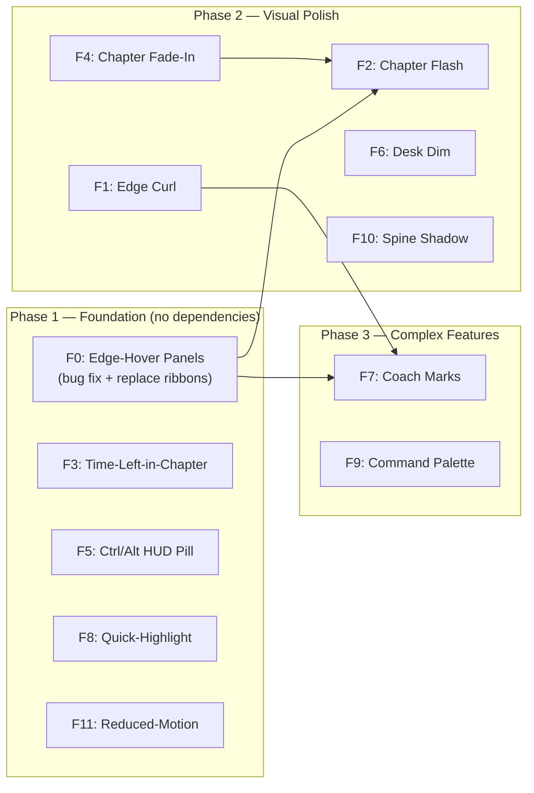

# Folio Reader — UX Features LLD Plan & Test Specification

> **Version:** 2.0 — Replaces ribbon nav with edge-hover chapter panels  
> **Date:** 2026-09-26  
> **Audience:** Core developers, reviewers  
> **Repository:** `ebook_reader_glm53flash / tauri_epub_reader`

---

## Table of Contents

1. [Bug Fix: Replace Dual Silk Ribbons → Edge-Hover Chapter Panels](#f0-replace-silk-ribbons)
2. [F1: Edge Hover Page-Curl Affordance](#f1-edge-curl)
3. [F2: Chapter-Crossing Title Flash](#f2-chapter-flash)
4. [F3: Time-Left-in-Chapter](#f3-time-left)
5. [F4: Progressive Chapter Fade-In](#f4-chapter-fade)
6. [F5: Ctrl/Alt+Wheel HUD Pill](#f5-wheel-hud)
7. [F6: Desk Dimming on Idle](#f6-desk-dim)
8. [F7: First-Run Coach Marks](#f7-coach-marks)
9. [F8: Selection Bar Quick-Highlight](#f8-quick-highlight)
10. [F9: Command Palette (Ctrl+K)](#f9-command-palette)
11. [F10: Turn-Progress Spine Shadow](#f10-spine-shadow)
12. [F11: Reduced-Motion Turn Variant](#f11-reduced-motion)
13. [Implementation Order & Dependency Graph](#implementation-order)
14. [Test Suite: `tests/e2e/ux_v2.spec.mjs`](#test-suite)

---

<a id="f0-replace-silk-ribbons"></a>
## F0 — Replace Silk Ribbons with Edge-Hover Chapter Panels

### Problem

The dual silk chapter ribbons (`#chRibbonPrev`, `#chRibbonNext`) have a structural bug: `updateChapterRibbons()` resolves the current chapter via `base(href)` matching against the flattened `tocItems` array. In books where **multiple TOC entries share the same base filename** (e.g. `chapter1.xhtml` with fragment anchors `#section-a`, `#section-b`), `findIndex()` always returns the **first** match. This causes the "next chapter" ribbon to get stuck — it perpetually points to the entry after the first match rather than the entry after the *current* sub-section.

The Taoism EPUB demonstrates this: multiple TOC entries (e.g. "Inaction", "Non-Interference") reference the same spine file with different fragment anchors. Once the reader is past the first match, `idx` is always 0 (fallback to `tocCurIdx` which was set during TOC load), so `nextHref` is always `tocItems[1].href`.

### Design: Edge-Hover Chapter Panels

Replace both silk ribbon buttons with **two invisible hover zones** in the empty margin space between the page and screen edges. These panels appear only on hover, showing nearby chapters for quick navigation.

#### Visual Behavior

```
┌──────────────────────────────────────────────────────┐
│  desk (background)                                   │
│  ┌─────┐  ┌──────────────────────────┐  ┌─────┐     │
│  │ CH  │  │                          │  │ CH  │     │
│  │ NAV │  │      Reading Page        │  │ NAV │     │
│  │ LEFT│  │      (#viewer)           │  │RIGHT│     │
│  │     │  │                          │  │     │     │
│  └─────┘  └──────────────────────────┘  └─────┘     │
│                                                       │
└──────────────────────────────────────────────────────┘
```

- **Idle state:** Only a subtle 16×16 SVG icon (§ or ≡ chapter glyph) at mid-height, 30% opacity, non-intrusive.
- **Hover state:** Panel fades in (opacity 0→1, 150ms ease) showing:
  - **Left panel:** Previous 2 chapters (clickable rows, oldest first).
  - **Right panel:** Next 2 chapters (clickable rows, nearest first).
- **Click:** Navigates to selected chapter, pushes `NavHistory`, closes panel.
- **Mouse leave:** Panel fades out (150ms).

#### HTML Structure

```html
<!-- Inside #stage, flanking #wrap, grid-column 1 and 3 -->
<div id="chNavLeft" class="ch-nav-panel ch-nav-left" aria-label="Previous chapters">
  <div class="ch-nav-hint">§</div>
  <div class="ch-nav-list">
    <button class="ch-nav-item" data-ch-idx="0"></button>
    <button class="ch-nav-item" data-ch-idx="1"></button>
  </div>
</div>
<div id="chNavRight" class="ch-nav-panel ch-nav-right" aria-label="Next chapters">
  <div class="ch-nav-hint">§</div>
  <div class="ch-nav-list">
    <button class="ch-nav-item" data-ch-idx="0"></button>
    <button class="ch-nav-item" data-ch-idx="1"></button>
  </div>
</div>
```

#### CSS

```css
.ch-nav-panel {
  position: absolute; top: 0; bottom: 0; width: 120px;
  display: flex; flex-direction: column; align-items: center;
  justify-content: center; z-index: 20;
  pointer-events: auto; cursor: default;
}
.ch-nav-left  { left: 0;  }
.ch-nav-right { right: 0; }

.ch-nav-hint {
  font: 500 14px var(--sans); color: var(--muted);
  opacity: 0.3; transition: opacity 150ms ease;
}
.ch-nav-panel:hover .ch-nav-hint { opacity: 0; }

.ch-nav-list {
  position: absolute; inset: 0;
  display: flex; flex-direction: column;
  justify-content: center; gap: 6px; padding: 12px 8px;
  opacity: 0; visibility: hidden;
  transition: opacity 150ms ease, visibility 150ms;
  background: color-mix(in srgb, var(--page) 92%, var(--ink));
  border-radius: 8px; box-shadow: 0 4px 16px rgba(0,0,0,.15);
}
.ch-nav-panel:hover .ch-nav-list {
  opacity: 1; visibility: visible;
}

.ch-nav-item {
  background: none; border: none; text-align: left;
  font: 500 12px/1.4 var(--sans); color: var(--ink);
  padding: 6px 10px; border-radius: 6px; cursor: pointer;
  white-space: nowrap; overflow: hidden; text-overflow: ellipsis;
  transition: background 120ms;
}
.ch-nav-item:hover { background: var(--sel); }
.ch-nav-item.disabled { opacity: 0.3; pointer-events: none; }

body.state-landing .ch-nav-panel { display: none !important; }
body.chrome-hidden .ch-nav-panel .ch-nav-hint { opacity: 0.15; }
```

#### JS: `updateChapterNav()` (replaces `updateChapterRibbons()`)

**Key fix:** Instead of only matching `base(href)`, also match the fragment. Use the spine index as a fallback, and walk the spine to resolve the closest TOC entry.

```javascript
function updateChapterNav() {
  const leftPanel  = el('chNavLeft');
  const rightPanel = el('chNavRight');
  if (!leftPanel || !rightPanel || !state.book) return;

  const loc = state.rendition ? state.rendition.currentLocation() : null;
  const curHref = loc && loc.start ? loc.start.href : '';
  const curIndex = loc && loc.start ? loc.start.index : -1;

  // Resolve current TOC position using BOTH base AND fragment matching
  const base = x => String(x||'').split('/').pop().split('#')[0];
  const frag = x => { const h = String(x||''); const i = h.indexOf('#'); return i >= 0 ? h.slice(i+1) : ''; };

  let idx = -1;
  if (tocItems && tocItems.length) {
    // 1. Try exact match (base + fragment)
    idx = tocItems.findIndex(i =>
      base(i.href) === base(curHref) && frag(i.href) === frag(curHref)
    );
    // 2. Fallback: base-only, find LAST match whose spine position <= current
    if (idx === -1) {
      const baseMatches = tocItems
        .map((item, i) => ({ item, i }))
        .filter(x => base(x.item.href) === base(curHref));
      if (baseMatches.length === 1) {
        idx = baseMatches[0].i;
      } else if (baseMatches.length > 1) {
        // Use tocCurIdx if within base matches, otherwise pick last
        const curMatch = baseMatches.find(x => x.i === tocCurIdx);
        idx = curMatch ? curMatch.i : baseMatches[baseMatches.length - 1].i;
      }
    }
    // 3. Final fallback: spine index proximity
    if (idx === -1 && curIndex >= 0) {
      idx = tocCurIdx >= 0 ? tocCurIdx : 0;
    }
  }

  // Gather prev 2 and next 2 chapters
  const prevItems = [];
  const nextItems = [];
  if (tocItems && idx >= 0) {
    for (let i = Math.max(0, idx - 2); i < idx; i++) {
      prevItems.push({ idx: i, label: tocItems[i].label, href: tocItems[i].href });
    }
    for (let i = idx + 1; i <= Math.min(tocItems.length - 1, idx + 2); i++) {
      nextItems.push({ idx: i, label: tocItems[i].label, href: tocItems[i].href });
    }
  }

  // Render panels
  renderChNavPanel(leftPanel, prevItems, 'No earlier chapters');
  renderChNavPanel(rightPanel, nextItems, 'No later chapters');
}

function renderChNavPanel(panel, items, emptyLabel) {
  const list = panel.querySelector('.ch-nav-list');
  if (!list) return;
  list.innerHTML = '';
  if (!items.length) {
    const empty = document.createElement('span');
    empty.className = 'ch-nav-item disabled';
    empty.textContent = emptyLabel;
    list.appendChild(empty);
    return;
  }
  items.forEach(item => {
    const btn = document.createElement('button');
    btn.className = 'ch-nav-item';
    btn.textContent = item.label || `Chapter ${item.idx + 1}`;
    btn.title = item.label;
    btn.addEventListener('click', () => {
      if (!state.rendition) return;
      const curLoc = state.rendition.currentLocation();
      const fromCfi = curLoc && curLoc.start ? curLoc.start.cfi : state.currentCfi;
      NavHistory.push(fromCfi,
        el('pageBadge') ? el('pageBadge').textContent : '',
        el('chapter') ? el('chapter').textContent : '');
      state.rendition.display(item.href);
      toast('Jumped to ' + (item.label || 'chapter'));
    });
    list.appendChild(btn);
  });
}
```

#### Migration

1. Remove `#chRibbonPrev`, `#chRibbonNext` HTML, CSS (`.silk-ribbon*`), and JS (`updateChapterRibbons()`).
2. Remove keyboard shortcuts `[` and `]` for ribbon nav (or repurpose for panel items).
3. Replace the `updateChapterRibbons()` call in `onRelocated()` with `updateChapterNav()`.
4. Update tests in `ux_simplicity.spec.mjs` (UX1, UX2 which test ribbons).

#### Tests

| ID | Test | Assertion |
|----|------|-----------|
| F0-1 | Panel hint icon visible at reading state | `#chNavLeft .ch-nav-hint` has opacity > 0 |
| F0-2 | Hover left panel → list fades in | After hover, `.ch-nav-list` computed opacity === 1 |
| F0-3 | Click chapter item in right panel → navigates | Badge changes after click, `NavHistory` anchor appears |
| F0-4 | Book with shared-file TOC entries (Taoism pattern) → panels update correctly per section | After navigating past "Inaction", right panel shows correct next entries |
| F0-5 | Panels hidden during landing state | `body.state-landing .ch-nav-panel` display === none |

---

<a id="f1-edge-curl"></a>
## F1 — Edge Hover Page-Curl Affordance

### Problem
The drag-to-flip gesture is undiscoverable. New users don't know they can drag the page edge.

### Design

When the pointer enters a **60px zone** from the left or right edge of `#viewer`, lift a 24×24px triangular corner using a pure CSS `transform: rotate(-12deg) translateY(-6px)` on a pseudo-element. The corner shows a soft shadow underneath, suggesting the page can be peeled.

#### Implementation

```css
#viewer::before, #viewer::after {
  content: ''; position: absolute; top: auto; bottom: 12px;
  width: 24px; height: 24px; z-index: 5;
  background: linear-gradient(135deg, transparent 50%, var(--hairS) 50%);
  opacity: 0; transition: opacity 120ms, transform 120ms;
  pointer-events: none; will-change: transform, opacity;
}
#viewer::before { right: 0; transform-origin: bottom right; }
#viewer::after  { left: 0;  transform-origin: bottom left;  }
#viewer.curl-right::before { opacity: 1; transform: rotate(-12deg) translateY(-6px); }
#viewer.curl-left::after   { opacity: 1; transform: rotate(12deg) translateY(-6px); }
```

**JS:** Track `pointermove` on `#viewer`. When `e.clientX` is within 60px of the right edge, add `.curl-right`; within 60px of left, add `.curl-left`; else remove both. Debounce with rAF. Skip when `state.turning`, `panelsOpen()`, or `prefers-reduced-motion`.

#### Cost
- Zero per-frame cost (GPU-composited transform on a pseudo-element)
- One `pointermove` listener (already exists for chrome auto-hide)

#### Tests

| ID | Test | Assertion |
|----|------|-----------|
| F1-1 | Move pointer to right edge of viewer | `#viewer` has class `curl-right` |
| F1-2 | Move pointer to center | Neither `curl-right` nor `curl-left` present |
| F1-3 | Reduced-motion media → no curl classes applied | No curl classes added |

---

<a id="f2-chapter-flash"></a>
## F2 — Chapter-Crossing Title Flash

### Problem
When flipping past a chapter boundary, there's no visual signal of the new chapter title.

### Design

After a committed page turn that crosses a spine boundary, flash the new chapter title in a caption overlay above the fold line for ~900ms, then fade out.

#### Implementation

**HTML:** `<div id="chFlash" class="ch-flash hide"></div>` — inside `#wrap`, absolutely positioned.

**CSS:**
```css
.ch-flash {
  position: absolute; top: 40%; left: 50%; transform: translateX(-50%);
  z-index: 25; pointer-events: none;
  font: 600 15px/1.3 var(--sans); color: var(--ink); opacity: 0.85;
  background: color-mix(in srgb, var(--page) 90%, var(--ink));
  padding: 8px 20px; border-radius: 10px;
  box-shadow: 0 4px 16px rgba(0,0,0,.12);
  transition: opacity 300ms ease;
}
.ch-flash.hide { opacity: 0; visibility: hidden; }
```

**JS:** In `onRelocated(loc)`, compare `loc.start.index` to a stored `lastSpineIndex`. If it differs:
1. Look up the new chapter title via `chapterFor(loc.start.href)`.
2. If the title differs from the previous one, set `#chFlash` text, remove `.hide`.
3. After 900ms, add `.hide`.

#### Tests

| ID | Test | Assertion |
|----|------|-----------|
| F2-1 | Turn past a chapter boundary → flash appears | `#chFlash` visible with correct chapter text |
| F2-2 | Flash auto-hides after ~1s | `#chFlash` has class `hide` after 1200ms |
| F2-3 | Turn within same chapter → no flash | `#chFlash` remains hidden |

---

<a id="f3-time-left"></a>
## F3 — Time-Left-in-Chapter

### Problem
`timeLeft` currently shows book-wide estimate. Users want chapter-level granularity.

### Design

Append a faint "· X min in ch." string to the existing `#timeLeft` element, computed from `d.total - d.page` (pages remaining in the current spine section) × 1.1 min/page.

#### Implementation

In `onRelocated()` (line ~2382), after the existing `timeLeft` computation:

```javascript
if (timeLeft && d && d.total) {
  const remBook = Math.max(0, totP - (state.spreadOn ? curP + 1 : curP));
  const minsBook = Math.max(1, Math.round(remBook * 1.1));
  const remCh = Math.max(0, d.total - (state.spreadOn ? d.page + 1 : d.page));
  const minsCh = Math.max(1, Math.round(remCh * 1.1));
  timeLeft.textContent = `· ⏱ ${minsBook} min left · ${minsCh} min in ch.`;
}
```

#### Tests

| ID | Test | Assertion |
|----|------|-----------|
| F3-1 | Badge shows "min in ch." text | `#timeLeft` text matches `/\d+ min in ch\./` |
| F3-2 | At last page of chapter, chapter time shows "1 min" | Chapter minutes === 1 |

---

<a id="f4-chapter-fade"></a>
## F4 — Progressive Chapter Fade-In

### Problem
Cold chapter loads (first iframe paint) cause a hard visual swap. Feels jarring.

### Design

When `onRelocated` fires after a spine index change (new chapter), apply a 120ms `opacity: 0→1` fade on the chapter iframe.

#### Implementation

In the `rendition.on('relocated')` handler, detect spine index change. When the new `loc.start.index !== lastSpineIndex`:

```javascript
const iframes = document.querySelectorAll('#viewer iframe');
iframes.forEach(iframe => {
  iframe.style.opacity = '0';
  iframe.style.transition = 'opacity 120ms ease';
  requestAnimationFrame(() => {
    requestAnimationFrame(() => { iframe.style.opacity = '1'; });
  });
});
```

Skip when `prefers-reduced-motion` matches, or when `settings.turnFx !== 'none'` (the compositor already handles the visual transition).

#### Tests

| ID | Test | Assertion |
|----|------|-----------|
| F4-1 | Navigate to new chapter → iframe briefly has opacity 0 | Iframe style includes `opacity: 0` immediately after display |
| F4-2 | After 200ms → iframe opacity is 1 | Iframe style opacity is `1` |

---

<a id="f5-wheel-hud"></a>
## F5 — Ctrl/Alt+Wheel HUD Pill

### Problem
`nudgeSize()` and `nudgeWidth()` provide no visual feedback during adjustment.

### Design

A floating HUD pill (`#nudgeHud`) appears near the top-center showing current value while adjusting, then fades after 800ms of inactivity.

#### HTML
```html
<div id="nudgeHud" class="nudge-hud hide"></div>
```

#### CSS
```css
.nudge-hud {
  position: fixed; top: 80px; left: 50%; transform: translateX(-50%);
  z-index: 80; pointer-events: none;
  font: 600 14px var(--sans); color: var(--ink);
  background: color-mix(in srgb, var(--page) 94%, var(--ink));
  padding: 6px 16px; border-radius: 999px;
  box-shadow: 0 4px 12px rgba(0,0,0,.15);
  transition: opacity 250ms ease;
}
.nudge-hud.hide { opacity: 0; }
```

#### JS
```javascript
let nudgeHudTimer = 0;
function showNudgeHud(text) {
  const hud = el('nudgeHud');
  if (!hud) return;
  hud.textContent = text;
  hud.classList.remove('hide');
  clearTimeout(nudgeHudTimer);
  nudgeHudTimer = setTimeout(() => hud.classList.add('hide'), 800);
}
```

Patch `nudgeSize()` to call `showNudgeHud('Aa ' + settings.size + 'px')` and `nudgeWidth()` to call `showNudgeHud('↔ ' + effWidth() + 'px')`.

#### Tests

| ID | Test | Assertion |
|----|------|-----------|
| F5-1 | Ctrl+wheel → HUD shows "Aa Xpx" | `#nudgeHud` visible, text matches `/Aa \d+(\.\d)?px/` |
| F5-2 | Alt+wheel → HUD shows "↔ Xpx" | `#nudgeHud` text matches `/↔ \d+px/` |
| F5-3 | After 1s of no interaction → HUD hidden | `#nudgeHud` has class `hide` |

---

<a id="f6-desk-dim"></a>
## F6 — Desk Dimming on Idle

### Problem
The desk/backdrop around the page stays at full brightness, reducing immersion during long reading.

### Design

After 10s of no pointer movement or keyboard input, gradually dim the desk by overlaying a 40% opacity dark layer. Any pointer movement or key press restores full brightness.

#### Implementation

```css
#deskDim {
  position: fixed; inset: 0; z-index: 1;
  background: rgba(0,0,0,0); pointer-events: none;
  transition: background 1.5s ease;
}
#deskDim.dim { background: rgba(0,0,0,0.35); }
body.state-landing #deskDim { display: none; }
```

**JS:**
```javascript
let deskDimTimer = 0;
function resetDeskDim() {
  clearTimeout(deskDimTimer);
  const dim = el('deskDim');
  if (dim) dim.classList.remove('dim');
  if (body.classList.contains('state-reading') && !panelsOpen()) {
    deskDimTimer = setTimeout(() => {
      if (dim && body.classList.contains('state-reading') && !panelsOpen()) {
        dim.classList.add('dim');
      }
    }, 10000);
  }
}
addEventListener('pointermove', resetDeskDim, { passive: true });
addEventListener('keydown', resetDeskDim);
```

#### Tests

| ID | Test | Assertion |
|----|------|-----------|
| F6-1 | After 11s idle → desk overlay has `.dim` class | `#deskDim.dim` exists |
| F6-2 | Move mouse → dim removed | `#deskDim` does not have `.dim` |
| F6-3 | Hidden in landing state | `#deskDim` display is none on landing |

---

<a id="f7-coach-marks"></a>
## F7 — First-Run Coach Marks (Once)

### Problem
Key features (drag-to-flip, rail scrub, `?` shortcuts) are invisible to new users.

### Design

On first book open (after the demo or first real book), show three sequential coach marks:

1. **"Drag the page edge to turn"** — pointing at the right edge of `#viewer`.
2. **"Drag the progress bar to jump"** — pointing at `#rail`.
3. **"Press ? for all shortcuts"** — pointing at keyboard.

Each mark is a floating tooltip with a "Got it" button. Clicking advances to the next or dismisses all. Stored as `folio-coach-done` in localStorage.

#### Implementation

```javascript
const CoachMarks = {
  steps: [
    { target: '#viewer', text: 'Drag the page edge to flip pages', anchor: 'right' },
    { target: '#rail',   text: 'Drag the progress bar to jump anywhere', anchor: 'bottom' },
    { target: null,      text: 'Press ? to see all keyboard shortcuts', anchor: 'center' },
  ],
  current: 0,
  done() { return !!localStorage.getItem('folio-coach-done'); },
  start() {
    if (this.done()) return;
    this.current = 0;
    this.show();
  },
  show() { /* render tooltip at target position */ },
  next() {
    this.current++;
    if (this.current >= this.steps.length) { this.finish(); return; }
    this.show();
  },
  finish() {
    localStorage.setItem('folio-coach-done', '1');
    /* remove tooltip element */
  }
};
```

#### Tests

| ID | Test | Assertion |
|----|------|-----------|
| F7-1 | First book open → coach mark visible | `#coachMark` is visible |
| F7-2 | Click "Got it" 3× → all dismissed, localStorage set | `folio-coach-done` === '1' |
| F7-3 | Second book open → no coach marks | `#coachMark` not in DOM |

---

<a id="f8-quick-highlight"></a>
## F8 — Selection Bar Quick-Highlight

### Problem
Highlighting requires: select text → click "Highlight" → pick color from palette. Three steps.

### Design

Add color dot buttons **directly** into the selection bar's main row, replacing the "Highlight" text button + hidden palette. One tap = highlighted.

#### HTML Change
```html
<div id="selBar" role="toolbar" aria-label="Selection tools">
  <div class="sel-row">
    <!-- Quick highlight swatches inline -->
    <button class="hl-dot sel-hl-quick" data-hl="yellow" style="background:#f7d64a" title="Yellow highlight"></button>
    <button class="hl-dot sel-hl-quick" data-hl="green" style="background:#7fe08a" title="Green highlight"></button>
    <button class="hl-dot sel-hl-quick" data-hl="blue" style="background:#7db8f8" title="Blue highlight"></button>
    <button class="hl-dot sel-hl-quick" data-hl="pink" style="background:#f2a0c0" title="Pink highlight"></button>
    <span class="sel-divider"></span>
    <button class="sel-btn" id="selDefine">Define</button>
    <button class="sel-btn" id="selFind">Find in book</button>
    <button class="sel-btn" id="selCopy">Copy</button>
  </div>
  <div id="selDef" hidden></div>
</div>
```

**JS:** Each `.sel-hl-quick` dot directly calls `Highlights.add(Highlights.lastCfi, dot.dataset.hl, selText)` and `hideSelBar()`.

#### Tests

| ID | Test | Assertion |
|----|------|-----------|
| F8-1 | Selection bar shows 4 color dots in main row | `.sel-hl-quick` count === 4 |
| F8-2 | Click yellow dot → highlight added in 1 step | `folio-highlights` contains entry with color `yellow` |
| F8-3 | No separate "Highlight" button or hidden palette | `#selHl` does not exist; `#selHlPal` does not exist |

---

<a id="f9-command-palette"></a>
## F9 — Command Palette (`Ctrl+K`)

### Problem
No unified action surface. Users must memorize shortcuts or navigate menus.

### Design

A fuzzy-filtered command palette modal, opened via `Ctrl+K`, listing all reader actions.

#### Commands Registry
```javascript
const COMMANDS = [
  { id: 'toc',        label: 'Open table of contents',   action: () => toggleToc(),      keys: 'T' },
  { id: 'settings',   label: 'Open typography settings',  action: () => toggleSheet(),    keys: 'S' },
  { id: 'search',     label: 'Search in book',            action: () => toggleSearch(),   keys: 'Ctrl+F' },
  { id: 'bookmark',   label: 'Toggle bookmark',           action: () => toggleBookmark(), keys: 'B' },
  { id: 'tts',        label: 'Read aloud / pause',        action: () => TTS.toggle(),     keys: 'R' },
  { id: 'fullscreen', label: 'Toggle fullscreen',         action: () => toggleFullscreen(), keys: 'F' },
  { id: 'spread',     label: 'Toggle two-page spread',    action: () => { /* cycle */ },  keys: 'D' },
  { id: 'bionic',     label: 'Toggle bionic reading',     action: () => setBionic(!settings.bionic) },
  { id: 'guide',      label: 'Toggle reading guide',      action: () => setGuide(!settings.guide), keys: 'G' },
  { id: 'help',       label: 'Keyboard shortcuts',        action: () => toggleHelp(),     keys: '?' },
  { id: 'home',       label: 'Go to home / library',      action: () => goHome(),         keys: 'H' },
  // Dynamic: chapter entries from tocItems
];
```

#### HTML
```html
<div id="cmdPalette" class="cmd-palette hide">
  <input id="cmdInput" type="text" placeholder="Type a command…" autocomplete="off">
  <ul id="cmdList"></ul>
</div>
```

#### Fuzzy Matching
Simple substring match on `label`, case-insensitive. TOC items added dynamically with prefix "Jump to: ".

#### Tests

| ID | Test | Assertion |
|----|------|-----------|
| F9-1 | Ctrl+K → palette visible with input focused | `#cmdPalette` visible, `#cmdInput` focused |
| F9-2 | Type "search" → filtered to Search command | `#cmdList` children include "Search in book" |
| F9-3 | Press Enter on first result → action executed, palette closes | Palette hidden, action fired |
| F9-4 | Escape → palette closes | `#cmdPalette` has class `hide` |
| F9-5 | Type chapter name → shows "Jump to: Chapter Name" | TOC-sourced entries appear in list |

---

<a id="f10-spine-shadow"></a>
## F10 — Turn-Progress Spine Shadow

### Problem
Mid-drag page turns don't show depth — the page stack feels flat.

### Design

During an active page drag, render a faint gradient shadow on the fore-edge of the underneath page. Shadow intensity scales with turn progress `p` (0→1).

#### Implementation

In `PageTurnCompositor.render(p)`, when the underneath surface element exists:

```javascript
const shadowIntensity = Math.min(p * 0.6, 0.3);
underneath.style.boxShadow =
  `inset ${dir > 0 ? '' : '-'}8px 0 16px rgba(0,0,0,${shadowIntensity})`;
```

Clear in `destroy()`.

#### Tests

| ID | Test | Assertion |
|----|------|-----------|
| F10-1 | Mid-drag at p=0.5 → underneath has inset shadow | Underneath element has `box-shadow` with non-zero alpha |
| F10-2 | After release → shadow cleared | No inset shadow on any page element |

---

<a id="f11-reduced-motion"></a>
## F11 — Reduced-Motion Turn Variant

### Problem
`fx: none` today is an instant swap. Users with `prefers-reduced-motion` get no transition at all.

### Design

When `prefers-reduced-motion: reduce` matches and turn FX is not explicitly `none`, use a 90ms crossfade instead of the fold compositor.

#### Implementation

In `effectiveFx()` (line ~3698):
```javascript
function effectiveFx() {
  if (matchMedia('(prefers-reduced-motion: reduce)').matches) return 'crossfade';
  return settings.turnFx || 'slide';
}
```

New `crossfade` path in `turn()`: snapshot the current page, display the next, and crossfade the snapshot over 90ms.

#### Tests

| ID | Test | Assertion |
|----|------|-----------|
| F11-1 | With reduced-motion → `effectiveFx()` returns 'crossfade' | Function returns 'crossfade' |
| F11-2 | Turn completes without fold compositor elements | No `.pt-fold` or `.pt-back-sheet` in DOM during turn |

---

<a id="implementation-order"></a>
## Implementation Order & Dependency Graph



> [!IMPORTANT]
> **F0 must land first** — it fixes the ribbon navigation bug and restructures the chapter nav surface that F2 (chapter flash) and F7 (coach marks) reference.

### Estimated Effort

| Feature | Complexity | Lines (est.) | Risk |
|---------|-----------|-------------|------|
| F0 | Medium | ~180 | Medium — TOC resolution edge cases |
| F1 | Low | ~40 | Low |
| F2 | Low | ~50 | Low |
| F3 | Trivial | ~10 | None |
| F4 | Low | ~30 | Low — timing vs compositor |
| F5 | Low | ~40 | None |
| F6 | Low | ~35 | None |
| F7 | Medium | ~120 | Low — UI positioning |
| F8 | Low | ~50 | Low — test migration |
| F9 | Medium-High | ~200 | Medium — fuzzy matching, keyboard nav |
| F10 | Low | ~20 | Low — compositor integration |
| F11 | Low | ~30 | Low |

---

<a id="test-suite"></a>
## Test Suite: `tests/e2e/ux_v2.spec.mjs`

All tests from the individual feature tables above will be consolidated into a single test file. The complete test file structure:

```javascript
import { test, expect } from '@playwright/test';
import { fresh, openDemoReady, badge, badgeWait } from './helpers.mjs';

test.beforeEach(async ({ page }) => { await fresh(page); });

// ─── F0: Edge-Hover Chapter Panels ───
test('F0-1 panel hint icons visible in reading state', async ({ page }) => { /* ... */ });
test('F0-2 hover left panel → list fades in', async ({ page }) => { /* ... */ });
test('F0-3 click chapter item → navigates with NavHistory', async ({ page }) => { /* ... */ });
test('F0-5 panels hidden during landing state', async ({ page }) => { /* ... */ });

// ─── F1: Edge Curl ───
test('F1-1 pointer near right edge → curl-right class', async ({ page }) => { /* ... */ });

// ─── F2: Chapter Flash ───
test('F2-1 chapter boundary crossing → flash appears', async ({ page }) => { /* ... */ });
test('F2-2 flash auto-hides after ~1s', async ({ page }) => { /* ... */ });

// ─── F3: Time-Left-in-Chapter ───
test('F3-1 badge shows chapter time estimate', async ({ page }) => { /* ... */ });

// ─── F5: Ctrl/Alt Wheel HUD ───
test('F5-1 Ctrl+wheel shows size HUD', async ({ page }) => { /* ... */ });
test('F5-2 Alt+wheel shows width HUD', async ({ page }) => { /* ... */ });
test('F5-3 HUD auto-hides after 1s', async ({ page }) => { /* ... */ });

// ─── F6: Desk Dim ───
test('F6-1 idle 11s → desk dim active', async ({ page }) => { /* ... */ });
test('F6-2 pointer move → dim clears', async ({ page }) => { /* ... */ });

// ─── F7: Coach Marks ───
test('F7-1 first open → coach mark visible', async ({ page }) => { /* ... */ });
test('F7-2 dismiss all → localStorage set', async ({ page }) => { /* ... */ });
test('F7-3 second open → no coach marks', async ({ page }) => { /* ... */ });

// ─── F8: Quick Highlight ───
test('F8-1 selection bar has 4 inline color dots', async ({ page }) => { /* ... */ });
test('F8-2 click dot → highlight added in 1 step', async ({ page }) => { /* ... */ });

// ─── F9: Command Palette ───
test('F9-1 Ctrl+K opens palette with focused input', async ({ page }) => { /* ... */ });
test('F9-2 type "search" → filtered results', async ({ page }) => { /* ... */ });
test('F9-3 Enter on result → executes and closes', async ({ page }) => { /* ... */ });
test('F9-4 Escape closes palette', async ({ page }) => { /* ... */ });

// ─── F10: Spine Shadow ───
test('F10-1 mid-drag → underneath has inset shadow', async ({ page }) => { /* ... */ });

// ─── F11: Reduced Motion ───
test('F11-1 reduced-motion → effectiveFx returns crossfade', async ({ page }) => { /* ... */ });
```

> [!NOTE]
> F0-4 (shared-file TOC test) requires a custom EPUB fixture with multiple TOC entries pointing to the same spine file with different fragment anchors. This should be built via `JSZip` in the test helper, similar to `buildStressBook()`.
